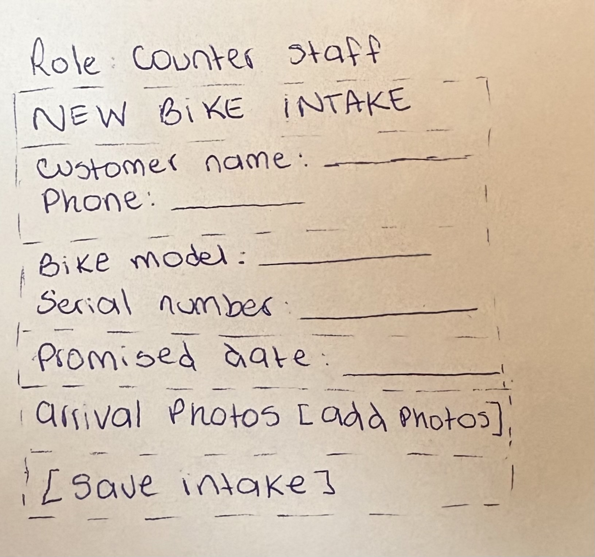
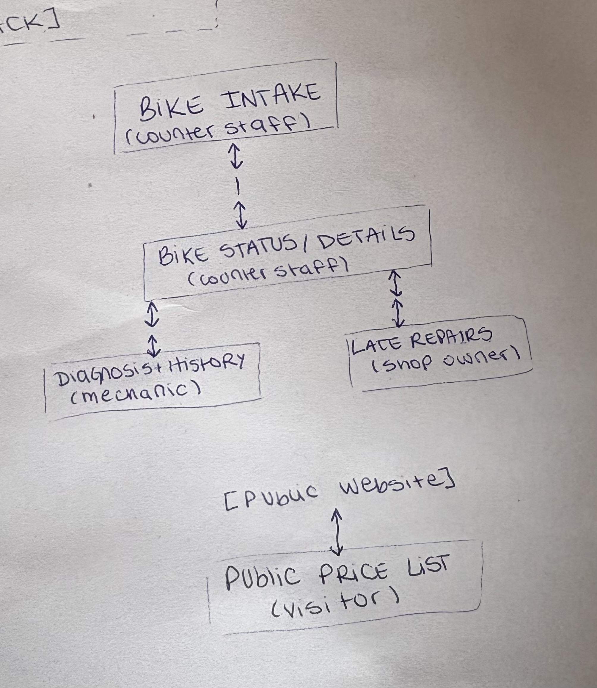

# Wireframes

These wireframes show the main screens of Wheelhouse. They are intentionally low fidelity and focus on the information and actions needed by each role.

## 1. Bike Intake

**Role: counter staff**

This screen is used when a bike arrives at the shop.

It includes:

- Customer name
- Customer phone number
- Bike model
- Serial number
- Promised completion date
- Arrival photos
- Save intake action

## 2. Bike Status / Details

**Role: counter staff**

This screen is used by the counter staff to check the current state of a repair and answer a customer who calls to ask if their bike is ready.

It shows:

- Bike model and serial number
- Current repair status
- Promised completion date
- Diagnosis
- Jobs and their prices
- Quote total
- Approve or decline actions
- Mark as picked up action when the bike is ready

If no matching bike is found, the screen shows:

> No matching bikes found.

## 3. Diagnosis and Repair

**Role: mechanic**

This screen is used by the mechanic to record the diagnosis and the jobs needed for the repair.

It includes:

- Bike model and serial number
- Diagnosis text
- Jobs from the service price list
- Price for each job
- Save action
- Previous repair history for the same bike

The previous repair history shows the date, diagnosis and jobs performed.

If the bike has no previous repairs, the screen shows:

> No previous repairs for this bike.

## 4. Late Repairs

**Role: shop owner**

This screen is used by the shop owner to see repairs that have passed their promised completion date.

Each late repair shows:

- Bike
- Promised completion date
- Current status

If there are no late repairs, the screen shows:

> No late repairs.

## 5. Public Price List

**Role: visitor**

This screen shows the current service price list from the shop.

It only contains public price information. It does not show customers or repair information.

# Navigation Graph

The internal screens are connected through the bike repair workflow.

- Counter staff can move between Bike Intake and Bike Status / Details.
- Bike Status / Details connects to Diagnosis and Repair for the mechanic.
- Bike Status / Details also connects to Late Repairs for the shop owner.
- The internal screens have a way to return, so they are not dead ends.
- The Public Price List is reached separately from the public website and does not connect to the private repair screens.